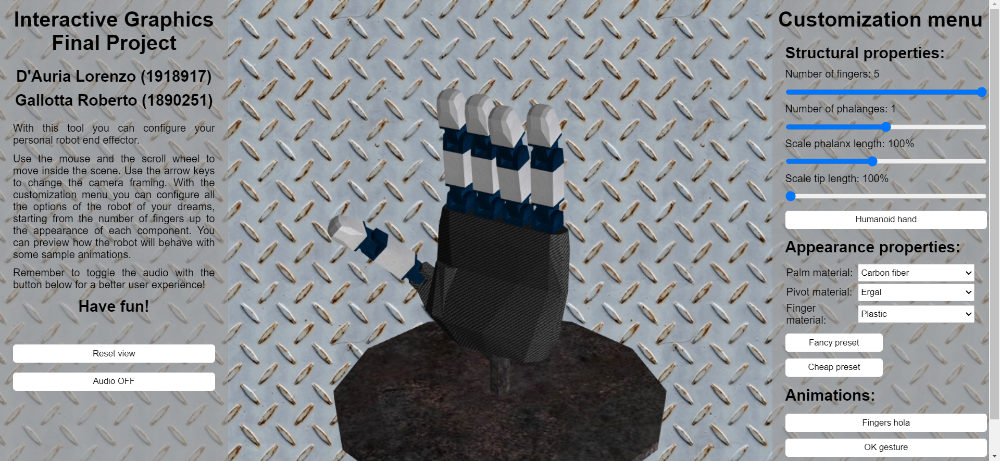

# Interactive Graphics course - Final project

### [Demo web page](https://lodauria.github.io/IG_Project_Robohand/robohand.html)

## Robohand:

Robohand is a simple graphic interface that allows the user to configure a custom robotic end effector, starting from humanoid hand or robotic hand.

The user can change the number of fingers and phalanxes, alter the length of fingers, change the materials or select an existing preset.

The user experience is enhanced with sounds and animations.

Complete documentation can be found [here](./Documentation.pdf).

## Authors:

- [Lorenzo D'Auria](https://www.linkedin.com/in/lorenzodauria/)
- [Roberto Gallotta](https://www.linkedin.com/in/roberto-g-9653a018a/)

## Libraries:
In this project we used standard WebGL with `MVnew.js` and `InitShaders.js` libraries taken from the textbook examples.